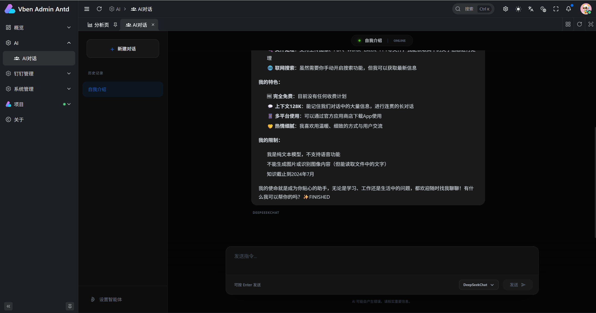

# 基于Vue和.NET的AI对话系统：使用SSE实现流式响应

在构建AI对话应用时，用户期望获得类似ChatGPT的流式回复体验——文字逐字出现，而不是等待漫长的加载后一次性展示。这种实时交互不仅提升了用户体验，还能让用户感受到AI的“思考”过程。本文将介绍如何利用 **Server-Sent Events (SSE)**  在 Vue 3 前端和 .NET 后端之间实现高效的流式数据传输，打造一个完整的AI对话系统。

## 为什么选择SSE？

WebSocket 是全双工通信，适用于频繁双向交互的场景。但在AI对话中，数据流主要是从服务器到客户端（AI逐字推送），客户端只需发送一次请求。SSE 基于HTTP，天然支持单向服务器推送，实现简单、自动重连、且与浏览器事件模型完美集成。因此 SSE 是实现流式响应的理想选择。

## 整体架构

我们的系统分为两部分：

- **后端**：[ASP.NET](https://asp.net/) Core 提供 SSE 端点 `/api/aiChats/completion`，接收用户输入，调用大模型（如DeepSeek），将模型返回的文本块通过SSE实时推送给前端。
- **前端**：Vue 3 组件通过 Fetch API 消费 SSE 流，解析事件，更新对话界面，并使用 `markdown-it` 渲染 Markdown 格式的回复。

下面逐步拆解实现细节。

---

## 后端实现：.NET Core SSE 端点

### 1. 设置响应头

SSE 要求响应类型为 `text/event-stream`，并禁用缓存和代理缓冲：

``` csharp
httpContext.Response.ContentType = "text/event-stream";
httpContext.Response.Headers.CacheControl = "no-cache";
httpContext.Response.Headers.Connection = "keep-alive";
httpContext.Response.Headers["X-Accel-Buffering"] = "no"; // 禁用Nginx缓冲
```

### 2. 接收请求并调用AI

我们设计了一个 `AIChatsCompletionCommand` 通过事件总线处理AI调用，这样控制器保持简洁。但为了清晰，这里简化展示核心逻辑：

``` csharp
[HttpPost("completion")]
public async Task CompletionAsync([FromBody] AIChatsCompletionRequest input)
{
    // ... 设置响应头

    // 创建命令对象，订阅流式事件
    var command = new AIChatsCompletionCommand
    {
        Prompt = input.Prompt,
        ChatClient = input.ChatClient
    };
    
    command.OnChunkReceivedAsync += async (chunk) =>
    {
        await WriteSseEventAsync("message", new { v = chunk });
    };

    // 执行AI调用（异步但会等待完成）
    await EventBus.PublishAsync(command);
    var result = command.Result;

    // AI完成后，推送token用量和状态
    await WriteSseEventAsync("message", new
    {
        p = "response",
        o = "BATCH",
        v = new[]
        {
            new { p = "accumulated_token_usage", v = result.CompletionTokens },
            new { p = "quasi_status", v = "FINISHED" }
        }
    });

    // 生成标题并推送
    var titleCommand = new AIChatsTitleCommand { ... };
    await EventBus.PublishAsync(titleCommand);
    await WriteSseEventAsync("title", new { content = titleCommand.Result });

    // 异步保存对话
    _ = EventBus.PublishAsync(new AIChatsSaveCommand { ... });

    // 发送关闭信号
    await WriteSseEventAsync("close", new { });
    
    // 结束响应
    await httpContext.Response.CompleteAsync();
}

private async Task WriteSseEventAsync(string eventName, object data)
{
    var json = JsonSerializer.Serialize(data);
    await httpContext.Response.WriteAsync($"{eventName}: {json}\n\n");
    await httpContext.Response.Body.FlushAsync();
}
```

**关键点**：

- 每个SSE事件由 `事件名: 数据\n\n` 组成，数据部分统一为JSON，便于前端解析。
- 流式文本块使用 `message` 事件，数据格式 `{ v: "部分内容" }`。
- AI完成后推送批处理信息，包含token用量和状态，前端可根据这些信息显示“已完成”。
- 标题生成和数据库保存异步执行，不影响主流程。

### 3. AI流式调用的实现

`AIChatsCompletionCommand` 内部通过 `CreateAIAgentAndRunStreamingAsync` 调用AI模型，并触发 `OnChunkReceivedAsync` 事件：

``` csharp
public async Task HandleAsync(AIChatsCompletionCommand command)
{
    await foreach (var chunk in _aiService.StreamAsync(command.Prompt))
    {
        await command.RaiseChunkReceivedAsync(chunk);
    }
    command.Result = ...; // 设置完整结果
}
```

这种事件驱动的解耦方式使控制器无需关心AI的具体实现。

---

## 前端实现：Vue 3 消费 SSE 流

### 1. 发送请求并读取流

前端使用 Fetch API 发起 POST 请求，然后通过 `response.body.getReader()` 获取流读取器：

``` typescript
const sendMessage = async () => {
  // 添加用户消息、占位AI消息等...

  const response = await fetch(`${apiURL}/aiChats/completion`, {
    method: 'POST',
    headers: { 
      'Content-Type': 'application/json',
      'Authorization': `Bearer ${token}`
    },
    body: JSON.stringify({
      Prompt: prompt,
      ChatClient: selectedModel.value,
      AIChatsId: 0
    })
  });

  const reader = response.body!.getReader();
  const decoder = new TextDecoder();

  while (true) {
    const { value, done } = await reader.read();
    if (done) break;

    const chunk = decoder.decode(value, { stream: true });
    const lines = chunk.split('\n\n');

    for (const line of lines) {
      if (!line.trim()) continue;

      if (line.startsWith('message:')) {
        const data = JSON.parse(line.replace('message:', '').trim());
        if (data.v && typeof data.v === 'string') {
          // 追加到当前AI消息
          const aiMsg = messages.value.find(m => m.id === aiMsgId);
          if (aiMsg) aiMsg.content += data.v;
        }
        // 处理批处理信息等...
      }

      if (line.startsWith('title:')) {
        const data = JSON.parse(line.replace('title:', '').trim());
        currentTitle.value = data.content;
        // 更新历史记录...
      }

      if (line.startsWith('close:')) {
        console.log('AI响应结束');
      }
    }
  }
}
```

**注意事项**：

- 解码时使用 `{ stream: true }` 防止多字节字符被截断。
- SSE 事件以 `\n\n` 分隔，我们按此分割行。
- 每个事件的数据都是JSON，直接解析即可。

### 2. Markdown 渲染

AI回复常包含 Markdown 格式，我们使用 `markdown-it` 渲染并配合自定义样式：

``` vue
<div v-html="md.render(msg.content)"></div>

<script setup>
import MarkdownIt from 'markdown-it';
const md = new MarkdownIt({
  html: false,        // 禁用HTML防XSS
  linkify: true,
  typographer: true
});
</script>

<style scoped>
.markdown-body :deep(pre) {
  background-color: #0d1117;
  padding: 1rem;
  border-radius: 12px;
}
/* 更多样式覆盖... */
</style>
```

### 3. 用户体验优化

- **自动滚动**：监听 `messages` 变化，使用 `nextTick` 和 `scrollTo` 平滑滚动到底部。
- **自适应输入框**：监听输入内容，动态调整 `textarea` 高度。
- **模型切换下拉**：简单点击切换，配合过渡动画。
- **侧边栏历史**：标题更新后同步到历史列表。

---

## 踩坑与解决方案

### 1. 代理服务器缓冲问题

SSE 要求数据立即发送，但 Nginx 默认会缓冲响应，导致前端收不到流式数据。解决方法是在后端响应头添加：

``` text
X-Accel-Buffering: no
```

或者在 Nginx 配置中关闭缓冲：

``` text
proxy_buffering off;
```

### 2. 事件格式设计

最初我们尝试直接发送纯文本块，但发现前端难以区分不同类型的事件（如文本块、标题、状态）。最终采用 **`事件名: JSON数据\n\n`** 的格式，让前端能够根据事件名灵活处理。

### 3. 连接中断与重连

SSE 本身支持自动重连，但我们的场景是一次性请求，结束后连接关闭。如果需要在网络闪断后恢复，可以考虑在前端记录已接收的内容，并重新发起请求携带断点标识（需后端支持）。

---

## 总结

通过 SSE，我们以极小的复杂度实现了 AI 对话的流式响应。后端只需设置正确的响应头并按格式推送事件，前端利用 Fetch API 的流式读取能力即可轻松解析。相比于 WebSocket，SSE 更适合这种单向数据流场景，且天然支持 HTTP/2 多路复用。

本文的实现已在实际项目中稳定运行，支持多模型切换、Markdown 渲染、对话保存等完整功能。如果你正在构建类似的 AI 应用，不妨尝试 SSE 方案，它足够简单且强大。

---

## 贴图



> 📌 **演示地址**：[http://106.54.42.201:5777/](http://106.54.42.201:5777/)